# The Foundry: PoE2 App

Overlay de escritorio para **Path of Exile 2** construido con **Quickshell** (QML/Qt6) sobre Wayland. Muestra precios de items y divisa en tiempo real, notas de build, monitor de economía con tasas cruzadas e instalador automático de filtros NeverSink, todo sin salir del juego.

---

## Características

- **Price Checker** — Consulta el precio de cualquier item con **Ctrl + D** o simplemente **copiándolo al portapapeles** — el Stash Pricer lo detecta automáticamente. Muestra los primeros listados con precio, vendedor y liga.
- **Waystone Danger Analyzer** — Al copiar un Waystone, la app analiza sus mods y avisa de combinaciones letales (Reflect, No Regen + Less Recovery, etc.) con código de severidad ☠/⚠. Detecta inglés y español.
- **Importador de builds de Mobalytics** — Pega una URL de `mobalytics.gg/poe-2/builds/…` y la app extrae la guía completa: overview, strengths/weaknesses, todas las variantes (Acts/Mapping/Endgame) con sus tabs, gear con mods, gemas + supports, resumen del árbol de pasivas con jewels y código PoB copiable. Builds agrupadas por clase con icono, refrescables con un clic.
- **Currency Tracker** — Widget siempre visible con el valor actualizado de las divisas principales (Divine, Exalted, Annulment, Vaal). Incluye **alertas de precio** configurables: recibe un aviso visual cuando una divisa sube o baja del umbral que definas. Arrastrable a cualquier posición.
- **Session Tracker** — Widget de sesión con cronómetro, contador de muertes (detectado automáticamente desde el log del juego) y zona actual. Arrastrable y colapsable. Reseteable con un clic.
- **Notas de Build** — Panel lateral con editor Markdown para apuntar skills, items clave y pasivas de tu build.
- **Economy Window** — Tabla completa de divisa con popup de tasas cruzadas al pasar el ratón. Selección de categoría lateral. Ventana redimensionable arrastrando los bordes (tamaño persistente entre sesiones).
- **Opciones de liga** — Cambia al vuelo entre ligas (Runes of Aldur, HC, Standard, Hardcore…) sin reiniciar. Controla la visibilidad de los widgets desde la pestaña Opciones.
- **Crafting Cheat Sheet** — Panel de referencia rápida con todos los orbes, essences, omens, catalysts y el crafteo rúnico de Runes of Aldur. Incluye descripción, a qué se aplica y tips de uso para cada uno.
- **Instalador NeverSink** — Descarga e instala directamente los filtros NeverSink para PoE2 desde GitHub. Detecta automáticamente la carpeta del juego, muestra la versión instalada y avisa cuando hay actualizaciones.

---

## Capturas

### Price Checker & Stash Pricer

<p align="center">
  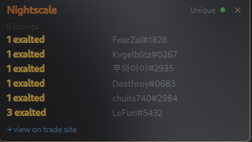
  <br><em>Overlay de búsqueda de precios — muestra listados reales de la API de trade</em>
</p>

> **Modo Ctrl+D:** Pasa el cursor sobre el item en el juego y pulsa **Ctrl + D** — inyecta un Ctrl+C al juego y muestra el precio al instante.  
> **Stash Pricer:** Al hacer Ctrl+C sobre cualquier item en el stash el overlay lo detecta automáticamente (monitorización del portapapeles cada 1.5 s) y lanza la búsqueda sin pulsar nada.  
> Requiere **xdotool** (`sudo pacman -S xdotool`) para el modo Ctrl+D.

---

### Importador de Builds (Mobalytics)

<p align="center">
  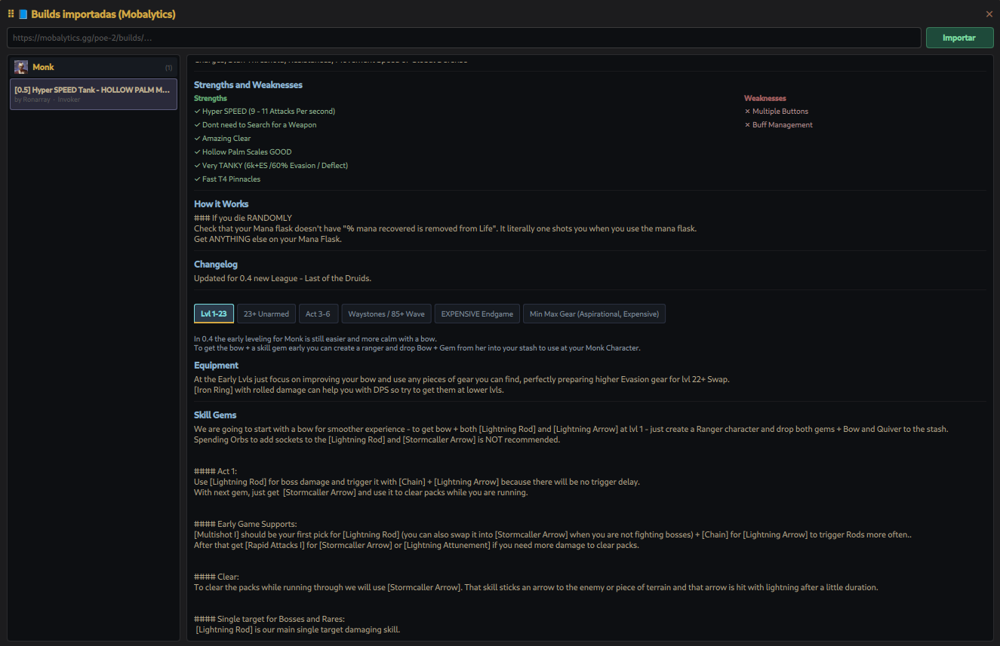
  <br><em>Pega una URL, importa la guía entera dentro del overlay</em>
</p>

Accesible desde el icono **📘** del widget Currency Tracker. Pegas una URL del tipo `https://mobalytics.gg/poe-2/builds/…` y la app:

1. Hace fetch del HTML con un script Python (`scripts/mob-extract.py`)
2. Extrae el JSON embebido en `window.__PRELOADED_STATE__` de la página
3. Convierte el árbol de bloques Lexical de Mobalytics en secciones renderizables
4. Reescribe los iconos `.avif` → `.webp` para que Qt6 los muestre sin plugins extras

**Lo que importa:**
- **Overview** del build, **Strengths / Weaknesses**, **changelog** y notas del creador
- **Tabs de variantes** (Act 1, Act 2, Mapping, Endgame, etc.) — click para cambiar entre ellas igual que en Mobalytics
- **Gear** con icono, nombre, mods explícitos por slot (16 slots: weapons, armours, jewelry, flasks, charms)
- **Skill Gems** con icono, nivel y supports asociados
- **Passive Tree** — árbol completo de PoE2 renderizado dentro de la app (ver imagen abajo): camino dorado de allocations con halo, retrato de la clase en el centro, ascendancy superpuesta en frame circular sobre el retrato. Iconos reales del juego.
- **PoB code** copiable a un clic

**Características del visor:**
- Builds **agrupadas por clase** (Monk, Druid, Sorceress, Witch…) con icono y contador
- **Ascendancy** mostrado en el subtítulo de cada build
- **🔄 Refrescar** — re-importa la URL para coger los cambios del creador
- **🗑 Borrar** por build (hover sobre la lista o botón en el header)
- Ventana **arrastrable** (cabecera ⠿) y **redimensionable** (bordes y esquinas)
- Persistencia local: builds, posición y tamaño se guardan entre sesiones

> ⚠️ **Aviso:** el importador depende de la estructura interna de Mobalytics. Si cambian su esquema de datos puede dejar de funcionar hasta que se actualice el script. Va contra sus términos de servicio en sentido estricto — pensado para uso personal.

<p align="center">
  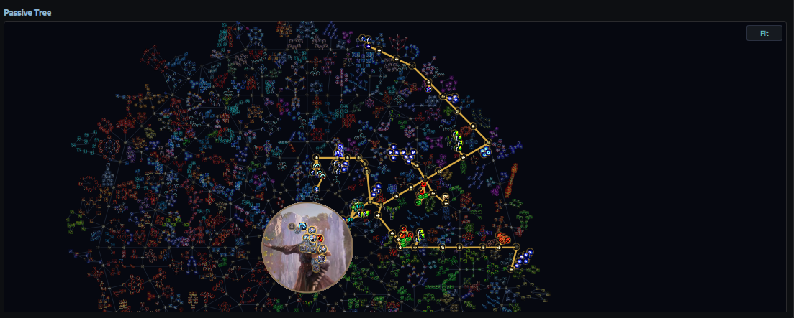
  <br><em>Árbol de pasivas dentro de cada build — camino dorado de allocations, retrato de clase en el centro, ascendancy superpuesta</em>
</p>

**Sobre el árbol de pasivas:**
- Datos del árbol vienen de [PathOfBuilding Community](https://github.com/PathOfBuildingCommunity/PathOfBuilding-PoE2) (descarga y conversión one-shot vía `scripts/fetch-tree.py` + `scripts/tree-lua-to-json.lua` — se cachea localmente)
- Iconos individuales de cada nodo se descargan desde la CDN de Mobalytics (que sirve los mismos paths de assets del juego en formato WebP)
- **Pan** con click izquierdo + arrastrar, **Zoom** con la rueda centrada en el cursor, botón **Fit** para reencuadrar
- Hover sobre cualquier nodo → tooltip con nombre, stats y tipo (Notable / Keystone / Jewel Socket / Mastery)
- Cambiar entre variantes de la build (tabs superiores) reencuadra automáticamente al camino de esa variante

También hay un **🌲 visor standalone** del árbol (icono al lado de 📘 en el Currency Tracker) — explorador del árbol entero sin allocations, con selector de clase y ascendancy para ver cualquier combinación de la 8 clases × ascendancies.

---

### Waystone Danger Analyzer

Al copiar (Ctrl+C) un **Waystone** desde el inventario o el map device, el overlay analiza sus mods automáticamente y muestra una alerta de severidad antes de que abras el mapa:

- ☠ **LETAL** — Reflect Phys/Ele, No Regen, combos sin sustain
- ⚠ **PELIGROSO** — Less Recovery, −Max Resists, Penetración de resistencias, Daño caos extra, Vulnerability, Elemental Weakness
- ⚠ **A vigilar** — Temporal Chains, Enfeeble, +Crit de mobs, +Proyectiles, +AoE, buffs expiran antes, −Movement Speed

Cada alerta explica por qué ese mod es peligroso. Detecta tanto texto en inglés como en español. Útil sobre todo para builds frágiles que no toleran ciertos mods (reflect en builds de daño puro, no regen sin leech, etc.).

---

### Currency Tracker

<p align="center">
  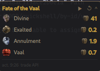
  <br><em>Widget siempre visible con el valor de las divisas principales y alertas configurables</em>
</p>

Haz clic en el icono 🔕 junto a cualquier divisa para configurar una alerta. Elige si disparar cuando el precio sube o baja del umbral y el valor en chaos. El icono se vuelve 🔔 dorado cuando hay alerta y rojo cuando se dispara.

---

### Session Tracker

<p align="center">
  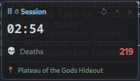
  <br><em>Cronómetro de sesión, muertes automáticas y zona actual</em>
</p>

- **Cronómetro** — tiempo acumulado desde que se inició o resetó la sesión.
- **Muertes** — detectadas automáticamente del log de PoE2 (`Client.txt`); se actualizan cada 12 segundos.
- **Zona** — última zona visitada leída del log.
- **↺** — resetea el cronómetro y las muertes a 0.
- Arrastrable a cualquier posición (posición persistente).

---

### Notas de Build

<p align="center">
  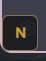&nbsp;&nbsp;&nbsp;
  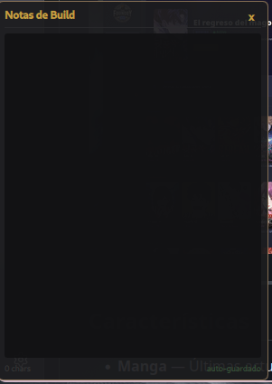
  <br><em>Botón de acceso rápido &nbsp;·&nbsp; Editor de notas con formato Markdown</em>
</p>

---

### Economy Window

<p align="center">
  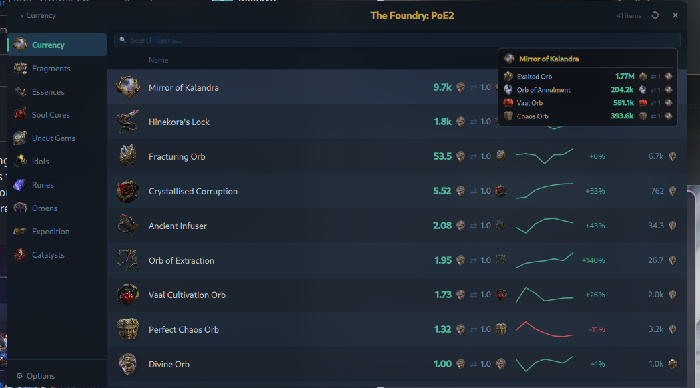
  <br><em>Monitor de economía con popup de tasas cruzadas</em>
</p>

---

### Crafting Cheat Sheet & Guías

<p align="center">
  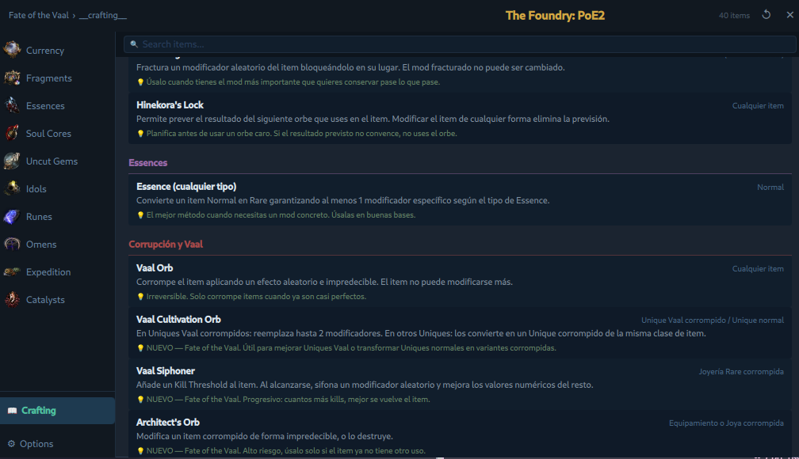
  <br><em>Chuleta de referencia rápida — todos los orbes y mecánicas de crafting con precio en tiempo real</em>
</p>

Accesible desde la pestaña **📖 Crafting** en la ventana de economía. La sub-pestaña **Chuleta** cubre:

- **Calidad** — Whetstone, Arcanist's Etcher, Armourer's Scrap, Gemcutter's Prism, Vaal Infuser
- **Cambio de rareza** — Transmutation, Augmentation, Regal, Alchemy, Chance
- **Modificación de mods** — Chaos Orb *(⚠ en PoE2 solo cambia 1 mod)*, Exalted, Annulment, Divine, Fracturing, Hinekora's Lock
- **Essences, Omens (Ritual), Catalysts (Breach)**
- **Corrupción y Vaal** — Vaal Orb, Vaal Cultivation Orb
- **Desecramiento (Abyss)** — Collarbone, Jawbone, Rib, Cranium, Vertebrae
- **Sockets de gema** — Artificer's Orb, Jeweller's Orbs
- **Runes of Aldur (0.5)** — crafteo rúnico: Remnant, Verisium/Runeforging, Ancient Runes, Runic Ward Runes, runas de Augment/meta-crafting, Aldur's Legacy
- **Soul Cores** — Trial of Chaos, Core Destabiliser → Ancient Soul Core, Orb of Extraction

---

### Guías de Crafting

<p align="center">
  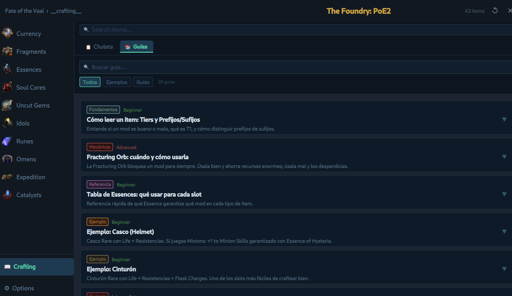
  <br><em>Sub-pestaña Guías — 28 guías con buscador y filtros por categoría</em>
</p>

<p align="center">
  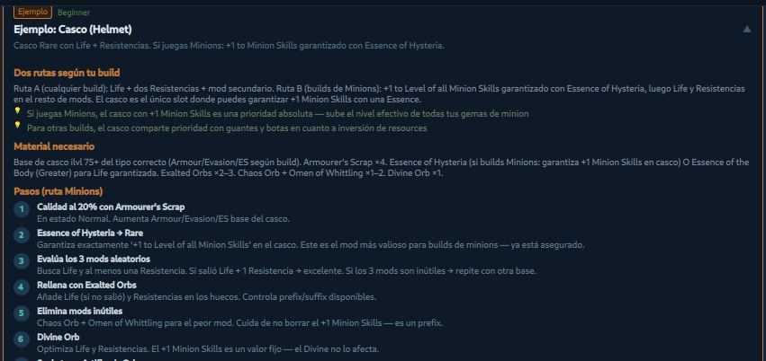
  <br><em>Vista expandida de una guía — pasos numerados, materiales necesarios y tips</em>
</p>

> ⚠️ **Aviso sobre las guías de crafting y ejemplos:** El contenido de las guías está generado en base a las mecánicas conocidas de PoE2 hasta **Runes of Aldur (0.5)**. Algunos valores numéricos exactos, nombres de mods o builds meta pueden estar ligeramente desactualizados respecto a los últimos patches y balance changes. **La base conceptual del crafteo (prefijos/sufijos, tiers, Essences, Catalysts, Exalted, Chaos, Divine, Corruption…) sigue siendo la misma** y las guías son una referencia válida para entender el sistema. Para valores exactos y mods actuales consulta siempre [poe2db.tw](https://poe2db.tw).

La sub-pestaña **Guías** incluye 28 guías de crafting organizadas en dos grupos:

- **Guías** — fundamentos, mecánicas avanzadas y referencia rápida:
  - Cómo leer un ítem: Tiers, Prefijos y Sufijos
  - Fracturing Orb: cuándo y cómo usarla
  - Tabla de Essences por slot
  - Recombinator: estrategia y riesgos
  - Corrupción por slot (qué buscar en cada pieza)
  - Crafting de joyas, armaduras, armas, waystones, frascos y más

- **Ejemplos** — recetas paso a paso para slots concretos:
  - Casco, Cinturón, Pecho, Arma (físico/hechizo), Anillo, Botas, Collar, Guantes
  - Cada ejemplo incluye materiales, pasos numerados con acciones y detalles, y tips específicos del slot

Cada guía es expandible con un clic y muestra el nivel de dificultad (Beginner / Intermediate / Advanced).

---

### Opciones de Liga

<p align="center">
  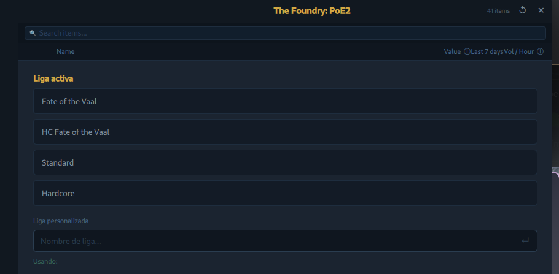
  <br><em>Selector de liga — cambia la fuente de datos sin reiniciar</em>
</p>

---

### Filtros NeverSink

<p align="center">
  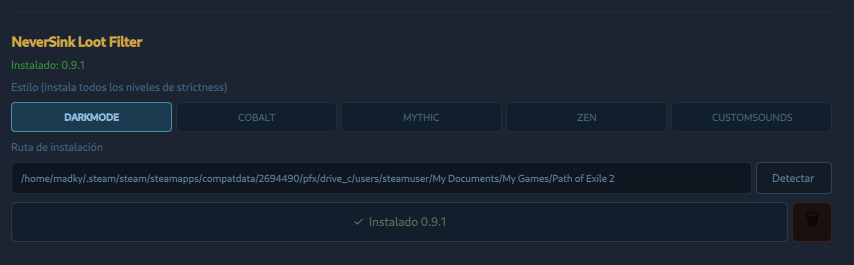
  <br><em>Instalador integrado — detecta la ruta del juego, selecciona estilo y descarga todos los niveles de estrictez</em>
</p>

---

## Requisitos del sistema

- **Wayland** — Hyprland, KDE Plasma (Wayland), Sway u otro compositor compatible con `wlr-layer-shell`.
- **Path of Exile 2** instalado vía **Steam + Proton** (para la detección automática de la carpeta de filtros).

---

## Dependencias

| Paquete | Para qué |
|---------|----------|
| `quickshell` ≥ 0.3.0 | Runtime QML del overlay |
| `qt6-base` | Módulos Qt6 base |
| `qt6-declarative` | Motor QML |
| `python3` | Detección automática de la ruta de instalación |
| `curl` | Descarga de filtros NeverSink desde GitHub |
| `unzip` | Extracción del archivo ZIP de filtros |
| `bash` | Scripts de instalación y gestión de filtros |
| `xdotool` | Inyectar Ctrl+C al juego desde el Price Checker |
| `wl-clipboard` | Leer el portapapeles en Wayland (Stash Pricer) |

### Instalación de dependencias

**Arch / CachyOS / Manjaro:**
```bash
sudo pacman -S quickshell python curl unzip bash xdotool wl-clipboard
```

**Otros sistemas:**  
Consulta el gestor de paquetes de tu distro. Quickshell puede instalarse desde [quickshell.outfoxxed.me](https://quickshell.outfoxxed.me).

---

## Instalación

```bash
git clone https://github.com/madkyp/poe2-overlay.git
cp -r poe2-overlay ~/.config/quickshell/poe2
```

Lanzar el overlay:
```bash
qs -p ~/.config/quickshell/poe2
```

O añadir a tu `hyprland.conf` para que arranque con el sistema:
```
exec-once = qs -p ~/.config/quickshell/poe2
```

### Atajo de teclado en Hyprland

Para abrir/cerrar el overlay con un atajo (toggle), añade esto a tu `~/.config/hypr/hyprland.conf` o `keybindings.conf`:

```
bind = CTRL, P, exec, pkill -x qs || qs -p ~/.config/quickshell/poe2
```

Con **Ctrl + P** la app se lanza si no está corriendo, y se cierra si ya lo está. Recarga la config con `hyprctl reload`.

Para el price check global hace falta el bind adicional:
```
bind = CTRL, D, global, poe2-foundry:pricecheck
```

---

## Configuración

Al primer arranque el overlay detecta automáticamente la carpeta de filtros de PoE2 buscando en las rutas estándar de Steam (`~/.local/share/Steam`, `~/.steam/steam`). Si no la encuentra, puedes introducirla manualmente en la pestaña **Opciones → Filtros**.

La configuración (liga, POESESSID, notas, versión de filtro) se guarda automáticamente en el perfil de Quickshell entre sesiones.

---

## Stack técnico

| Capa | Tecnología |
|------|-----------|
| UI / lógica | QML (Qt 6) + Quickshell 0.3.0 |
| Scripting | JavaScript (inline QML) |
| HTTP | `XMLHttpRequest` (QML nativo) |
| Procesos externos | `Process` de Quickshell |
| Persistencia | `PersistentProperties` de Quickshell |
| Filtros | NeverSink Filter for PoE2 (GitHub releases) |

---

## Fuentes de datos

- **Precios**: [poe2.ninja](https://poe2.ninja) / API oficial de trade de PoE2
- **Filtros**: [NeverSinkDev/NeverSink-Filter-for-PoE2](https://github.com/NeverSinkDev/NeverSink-Filter-for-PoE2)

---

## Licencia

Uso personal. Path of Exile 2 y sus assets son propiedad de Grinding Gear Games. Los filtros NeverSink son obra de NeverSinkDev.
